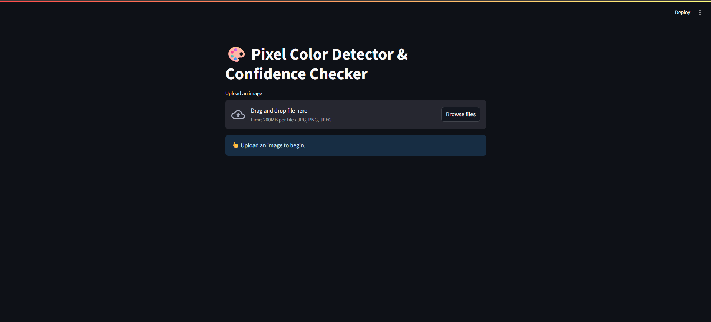

# 🎨 Pixel Color Detector & Confidence Checker

A Streamlit web application that allows you to upload images, select pixels, and analyze color similarity with confidence scoring.

## Features

- **Image Upload**: Support for JPG, PNG, and JPEG formats
- **Interactive Pixel Selection**: Use sliders to select any pixel in the uploaded image
- **Color Detection**: Automatically detects RGB and HEX values of selected pixels
- **Color Picker**: Interactive color picker that auto-updates with selected pixel colors
- **Confidence Scoring**: Calculate similarity between selected pixel and target color
- **Visual Feedback**: 
  - Pixel marking with red circle
  - Zoomed-in view of selected area
  - Match/No Match indicators based on confidence threshold
- **Real-time Updates**: All values update dynamically as you change pixel selection

## Installation

### Prerequisites

Make sure you have Python 3.7+ installed on your system.

### Required Dependencies

Install the required packages using pip:

```bash
pip install streamlit opencv-python numpy pillow
```

Or install from requirements file (if available):

```bash
pip install -r requirements.txt
```

### Individual Package Installation

```bash
pip install streamlit
pip install opencv-python
pip install numpy
pip install pillow
```

## Usage

### Running the Application

1. Navigate to the project directory:
   ```bash
   cd path/to/color_picker
   ```

2. Run the Streamlit application:
   ```bash
   streamlit run app.py
   ```

3. Open your web browser and go to the URL displayed in the terminal (typically `http://localhost:8501`)

### Using the Application

1. **Upload Image**: Click "Browse files" and select an image (JPG, PNG, or JPEG)

2. **Select Pixel**: Use the X and Y sliders to choose a pixel coordinate on the image

3. **View Color Information**: 
   - The sidebar displays the selected pixel's RGB and HEX values
   - The color picker automatically updates to match the selected pixel

4. **Compare Colors**: 
   - Use the color picker to select a target color for comparison
   - View the confidence score showing similarity percentage
   - See match/no match indication based on 60% threshold

5. **Visual Analysis**:
   - View the marked pixel (red circle) on the image
   - Examine the zoomed-in view for precise pixel selection

## How It Works

### Color Similarity Algorithm

The application uses Euclidean distance in RGB color space to calculate similarity:

```python
distance = √[(R₁-R₂)² + (G₁-G₂)² + (B₁-B₂)²]
confidence = (1 - distance/max_distance) × 100%
```

Where `max_distance` is the maximum possible RGB distance (√(255² + 255² + 255²)).

### Confidence Scoring

- **≥ 60%**: Match (Green checkmark)
- **< 60%**: No Match (Red X)

## File Structure

```
color_picker/
├── app.py              # Main Streamlit application
├── README.md           # This file
├── requirements.txt    # Python dependencies (optional)
└── screenshots/        # Application screenshots
    ├── main_interface.png
    ├── pixel_selection.png
    └── color_comparison.png
```

## Code Overview

### Main Functions

- `get_pixel_color(image, x, y)`: Extracts RGB values from specified pixel coordinates
- `color_similarity(color1, color2)`: Calculates Euclidean distance between two colors
- `hex_to_rgb(hex_color)`: Converts HEX color code to RGB tuple
- `rgb_to_hex(rgb_color)`: Converts RGB tuple to HEX color code

### Key Components

- **Image Processing**: Uses OpenCV and PIL for image handling
- **UI Components**: Streamlit widgets for file upload, sliders, and color picker
- **Visual Markers**: OpenCV circle drawing for pixel marking
- **Zoom Functionality**: 50x50 pixel area zoom around selected point

## Troubleshooting

### Common Issues

1. **TypeError: image() got an unexpected keyword argument 'use_container_width'**
   - This occurs with older Streamlit versions
   - Solution: Remove `use_container_width=True` from `st.image()` calls

2. **Module not found errors**
   - Ensure all required packages are installed
   - Try upgrading pip: `pip install --upgrade pip`

3. **Image not displaying**
   - Check image format (must be JPG, PNG, or JPEG)
   - Ensure image file is not corrupted

### Streamlit Version Compatibility

This application is compatible with various Streamlit versions. If you encounter issues with newer features, consider upgrading:

```bash
pip install --upgrade streamlit
```

## Contributing

Feel free to contribute to this project by:

1. Reporting bugs
2. Suggesting new features
3. Submitting pull requests
4. Improving documentation

## License

This project is open source and available under the [MIT License](LICENSE).

## Screenshots

### Main Interface

*The main application interface showing image upload and initial view*

### Pixel Selection

*Interactive pixel selection with sliders and visual feedback*

### Color Comparison

*Color comparison with confidence scoring and match indicators*

---

**Note**: This application runs locally and does not store or transmit your images anywhere. All processing happens on your local machine.